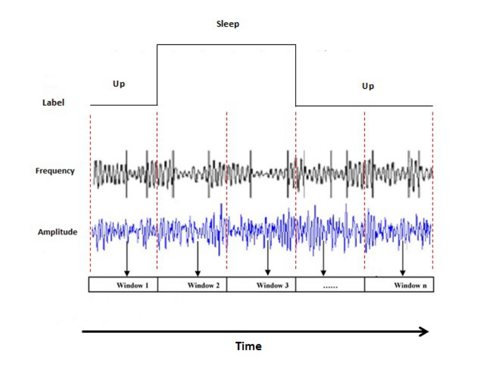

# Introduction

The Objective is trains and tests a machine learning model, i.e., Support Vector Machine (SVM) to be able to automatically detect the start and end time of a sleep period (without using the manually provided labels)

The data is collected from the smartphone of eight different users (e.g., noise, light, step count, screen, etc.). The data also contains a file with labels from the users, in which they indicated a start and end time for their sleep period.

## Installation
For python environment setup:

```bash
conda install python=3.9

conda create -n py39 python=3.9
conda activate py39 
```

## Contributing

* Preprocessed and labeled data to have a uniform ones
* Calculated "mean" and " standard deviation" for each features to understand which one was most effective for predicting/detecting the sleep period.
* "Noise" was considered as the most effective feature

* A time window with the lenght of 5 sec was considered

* For each segment, the mean and standard deviation of frequency and amplitude are calculated and then will be used as an input for classification (SVM).
* **Two methods for the classification:**
    * Subject-specific analysis: 
      * Train the model for a subject (e.g., "Jonas“) and evaluate it on same the subject data. 


    * Subject-wise training:  
      * Train the model for a subject (e.g., "Jonas“) and evaluates it on different subject (e.g., “Jessica”)


## License

[MIT](https://choosealicense.com/licenses/mit/)